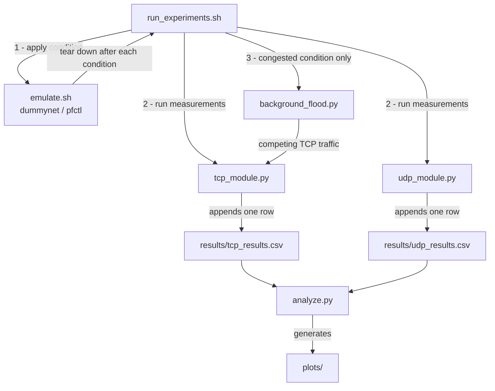
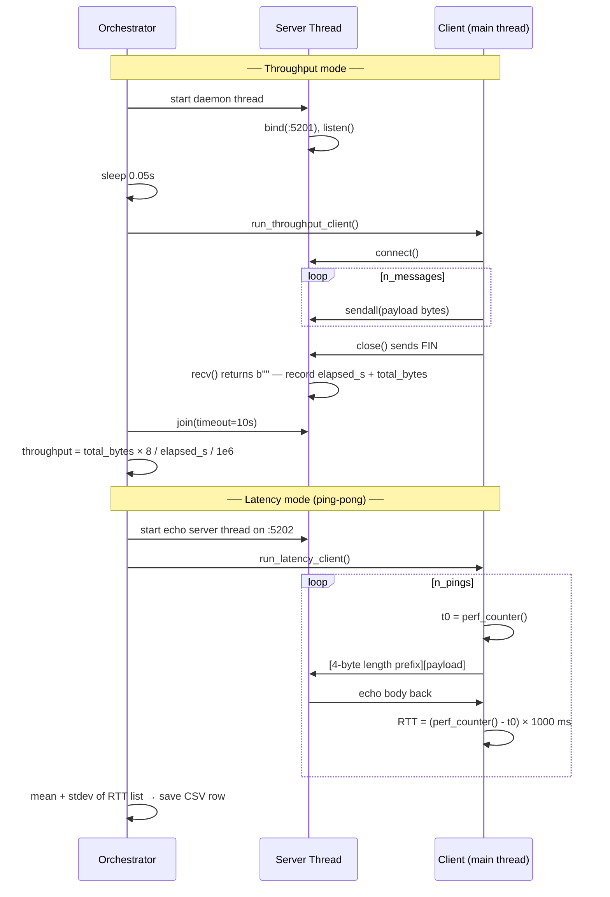
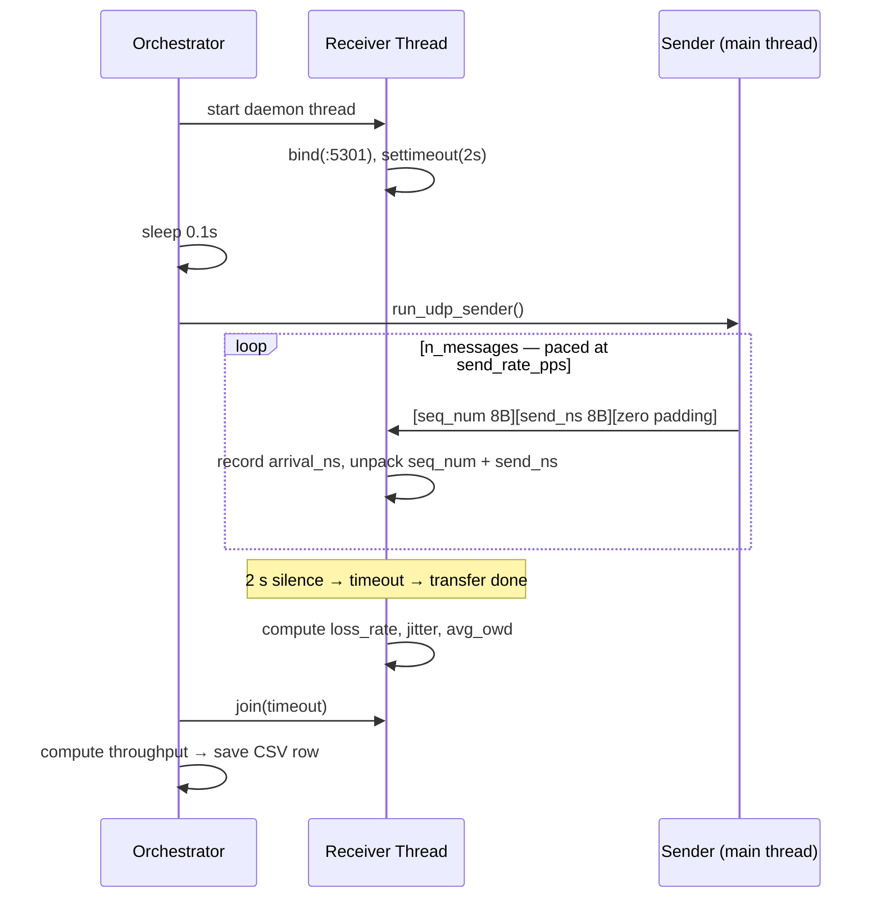
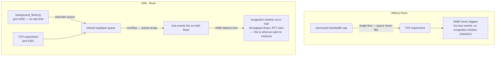

# CS 5470 — Network Performance Analyzer

Measures how **MTU / payload size** and **socket buffer settings** affect TCP and UDP
performance on the loopback interface (`127.0.0.1`). Network conditions (latency,
bandwidth caps, packet loss, bufferbloat) are emulated with macOS's built-in
`dummynet` traffic shaper.

| Module | Status | What it does |
|--------|--------|--------------|
| `src/udp_module.py` | Complete | UDP sender + receiver — throughput, loss, jitter, one-way delay |
| `src/tcp_module.py` | Complete | TCP sender + receiver — throughput, RTT latency |
| `src/background_flood.py` | Complete | Background TCP flood for congestion comparison |
| `src/analyze.py` | Complete | Aggregates CSVs across 3 runs, generates 5 plots into `plots/` |

Supporting scripts (`src/emulate.sh`, `run_experiments.sh`) are still to be built —
see [Files still to be created](#files-still-to-be-created).

---

## Architecture

### System pipeline

How the scripts connect from start to finish:



### TCP module — what happens inside one run

Both throughput and latency modes run sequentially per invocation. Each produces metrics that are saved together in one CSV row.



### UDP module — what happens inside one run



### Why background_flood.py exists

`dummynet`'s bandwidth cap alone is **not enough** to trigger TCP's congestion control (AIMD). Here is why, and what the flood fixes:



In short: the flood creates the **competition** that forces the queue to overflow, which produces the **loss events** that activate AIMD. Without it, TCP on loopback under a bandwidth cap just slows down gracefully with no observable congestion control behavior. UDP is unaffected by the flood (it has no congestion control), so the contrast between TCP backing off and UDP holding steady becomes clearly visible in the results.

---

## Prerequisites

| Requirement | Version | Notes |
|-------------|---------|-------|
| macOS | Any modern version | `dummynet` is macOS/BSD only — Linux is not supported |
| Python | 3.14+ | Enforced by `.python-version` |
| uv | Latest | Python package + venv manager — replaces pip/venv |

### Install uv

If you don't have `uv` yet, install it with one command:

```bash
curl -LsSf https://astral.sh/uv/install.sh | sh
```

Then restart your terminal so the `uv` command is on your `PATH`. You can verify
it worked by running:

```bash
uv --version
```

---

## Setup

All steps below are run **once**, from the project root directory.

### Step 1 — Clone the repo

```bash
git clone <repo-url>
cd 5470_Final_Project
```

### Step 2 — Create the virtual environment and install dependencies

`uv` reads `pyproject.toml` and handles everything automatically:

```bash
uv sync
```

This creates a `.venv/` folder inside the project and installs:
- `matplotlib` — plotting
- `numpy` — numerical helpers
- `pandas` — CSV aggregation
- `pytest` — test runner (dev dependency)

You do **not** need to run `pip install` or `python -m venv` manually. `uv sync`
does both in one step.

### Step 3 — Verify the setup

Run these two commands to confirm everything installed correctly:

```bash
uv run python --version
```

You should see `Python 3.14.x`. If you see an older version, make sure you are in
the project directory — `uv` uses the `.python-version` file to select the right
interpreter.

```bash
uv run pytest tests/ -v
```

You should see 28 tests collected and all passing. If any fail, check the
[Troubleshooting](#troubleshooting) section at the bottom.

---

## Quickstart — Your First Experiment

This walks through running one complete measurement from scratch to results. It
takes about 30 seconds.

### Step 1 — Run a UDP experiment

```bash
uv run python src/udp_module.py \
    --payload 1024 \
    --buffer 65536 \
    --messages 100 \
    --rate 200 \
    --label baseline \
    --run 1
```

You will see a line printed like:

```
UDP | baseline | payload=1024B | throughput=1.63 Mbps | loss=0.00% | jitter=0.21ms | owd=0.038ms
```

### Step 2 — Check what was saved

```bash
cat results/udp_results.csv
```

You should see a header row followed by one data row:

```
protocol,payload_bytes,buffer_bytes,condition,throughput_mbps,loss_rate_pct,jitter_ms,avg_owd_ms,run_index
UDP,1024,65536,baseline,1.6312,0.0,0.2134,0.0381,1
```

### Step 3 — Run a TCP experiment

```bash
uv run python src/tcp_module.py \
    --payload 1024 \
    --buffer 65536 \
    --messages 100 \
    --label baseline \
    --run 1
```

You will see:

```
TCP | baseline | payload=1024B | throughput=3241.57 Mbps | avg_rtt=0.018ms | rtt_stdev=0.004ms
```

### Step 4 — Check what was saved

```bash
cat results/tcp_results.csv
```

```
protocol,payload_bytes,buffer_bytes,condition,throughput_mbps,avg_latency_ms,latency_stdev_ms,run_index
TCP,1024,65536,baseline,3241.5734,0.018,0.004,1
```

You now have one row in each CSV. The full experiment sweep repeats this across
many payload sizes, buffer sizes, and conditions — that is what `run_experiments.sh`
will automate once it is built.

---

## Step-by-Step: UDP Module

### What it does

The UDP module sends a stream of datagrams at a controlled rate and measures what
arrived at the receiver. Because UDP has no delivery guarantee, every datagram is
stamped with a sequence number and a send timestamp so the receiver can detect
lost packets and measure timing.

### Running it

**Step 1 — Choose your parameters.**

| Flag | What to set | Example |
|------|-------------|---------|
| `--payload` | Size of each datagram in bytes. Must be at least 16 (header size). Try 64, 512, 1024, 4096. | `--payload 1024` |
| `--buffer` | Socket buffer size in bytes. Controls how much the OS can queue. Try 4096, 65536, 262144. | `--buffer 65536` |
| `--messages` | How many datagrams to send. 1000 is a good default. | `--messages 1000` |
| `--rate` | How many datagrams per second to send. 500 means one every 2 ms. | `--rate 500` |
| `--label` | A name for this condition. Written to the CSV so you can filter results later. | `--label baseline` |
| `--run` | Which repetition this is. Use 1, 2, or 3. Run three times to average out noise. | `--run 1` |

**Step 2 — Run the command.**

```bash
uv run python src/udp_module.py \
    --payload 1024 \
    --buffer 65536 \
    --messages 1000 \
    --rate 500 \
    --label baseline \
    --run 1
```

The experiment takes about `messages / rate` seconds to send (here: 1000 / 500 = 2 s)
plus a 2-second receiver timeout at the end. Total: ~4 seconds.

**Step 3 — Read the output.**

```
UDP | baseline | payload=1024B | throughput=4.09 Mbps | loss=0.00% | jitter=0.12ms | owd=0.031ms
```

| Field | What it means |
|-------|--------------|
| `throughput=4.09 Mbps` | The receiver absorbed 4.09 megabits per second. At 1024 bytes × 500 pps = 512,000 bytes/s = 4.096 Mbps, this is close to the theoretical max — good. |
| `loss=0.00%` | No datagrams were dropped. On loopback with rate pacing this should always be near zero. A non-zero value here would indicate the receive buffer was too small for the send rate. |
| `jitter=0.12ms` | The inter-arrival gaps varied by about 0.12 ms on average. Very low on loopback. This number grows when a slow link or large queue causes irregular delivery. |
| `owd=0.031ms` | Each datagram took about 0.031 ms to travel from the sender to the receiver. On loopback this is essentially OS scheduling overhead. Under dummynet delay, this will rise to match the configured delay. |

**Step 4 — Repeat for three runs.**

```bash
uv run python src/udp_module.py --payload 1024 --buffer 65536 --messages 1000 --rate 500 --label baseline --run 2
uv run python src/udp_module.py --payload 1024 --buffer 65536 --messages 1000 --rate 500 --label baseline --run 3
```

Each run appends one more row. `analyze.py` will average across the three runs
when it is built.

**Step 5 — Inspect the CSV.**

```bash
cat results/udp_results.csv
```

---

## Step-by-Step: TCP Module

### What it does

The TCP module runs two measurements in sequence for every invocation:

1. **Throughput mode** — sends `--messages` × `--payload` bytes as fast as possible
   and measures how many megabits per second arrived at the server.
2. **Latency mode** — sends one message, waits for the echo, records the RTT, and
   repeats `--messages` times. Returns the mean and standard deviation of all RTTs.

Both results are saved in **one CSV row**.

### Running it

**Step 1 — Choose your parameters.**

| Flag | What to set | Example |
|------|-------------|---------|
| `--payload` | Message size in bytes. No minimum (unlike UDP). Try 64, 512, 1024, 4096. | `--payload 1024` |
| `--buffer` | Socket buffer size in bytes. | `--buffer 65536` |
| `--messages` | Number of messages. Used for both throughput (bulk count) and latency (ping count). | `--messages 1000` |
| `--label` | Condition name written to the CSV. | `--label baseline` |
| `--run` | Repetition index 1–3. | `--run 1` |
| `--flood` | Optional flag. Starts competing background traffic before the experiment. Omit for a clean baseline; include to observe congestion. | `--flood` |

**Step 2 — Run a clean baseline.**

```bash
uv run python src/tcp_module.py \
    --payload 1024 \
    --buffer 65536 \
    --messages 1000 \
    --label baseline \
    --run 1
```

The throughput phase sends 1000 × 1024 bytes = ~1 MB as fast as TCP will go.
The latency phase sends 1000 ping-pong messages. Both run in under a second on
loopback. Total experiment time: 1–3 seconds.

**Step 3 — Read the output.**

```
TCP | baseline | payload=1024B | throughput=3241.57 Mbps | avg_rtt=0.018ms | rtt_stdev=0.004ms
```

| Field | What it means |
|-------|--------------|
| `throughput=3241.57 Mbps` | TCP on loopback with no emulation is extremely fast — the OS never actually puts bytes on a NIC. This number drops significantly under dummynet bandwidth caps or with the flood active. |
| `avg_rtt=0.018ms` | The average round-trip time for a ping-pong message. On loopback this is essentially OS thread scheduling time. Under dummynet delay of 20 ms, expect this to rise to ~40 ms (delay is one-way, RTT doubles it). |
| `rtt_stdev=0.004ms` | How much the RTT varied between pings. Low stdev means consistent delivery. Under bufferbloat, stdev rises because some pings hit a full queue and wait longer. |

**Step 4 — Inspect the CSV.**

```bash
cat results/tcp_results.csv
```

---

## Step-by-Step: Congestion Comparison with `--flood`

This walkthrough shows how to directly observe TCP's AIMD congestion control by
comparing the same experiment with and without competing background traffic.

### What is happening

When `--flood` is passed, `background_flood.py` starts a TCP flood on port 5400
that hammers the loopback interface with continuous traffic. The experiment's TCP
flow now has to share the same queue. When the queue overflows, both flows lose
packets. TCP detects the loss and cuts its congestion window in half (the
"multiplicative decrease" in AIMD), reducing throughput and increasing latency.

### Step 1 — Run the baseline (no flood)

```bash
uv run python src/tcp_module.py \
    --payload 1024 \
    --buffer 65536 \
    --messages 1000 \
    --label baseline \
    --run 1
```

Note the throughput and avg_rtt values from the output.

### Step 2 — Run the congested version (with flood)

```bash
uv run python src/tcp_module.py \
    --payload 1024 \
    --buffer 65536 \
    --messages 1000 \
    --label congested \
    --run 1 \
    --flood
```

You will see an extra line printed before the results:

```
Background flood started on port 5400 — competing for loopback bandwidth
TCP | congested [flood active] | payload=1024B | throughput=... Mbps | avg_rtt=...ms | rtt_stdev=...ms
```

### Step 3 — Compare the two rows in the CSV

```bash
cat results/tcp_results.csv
```

You should see two rows — one labeled `baseline`, one labeled `congested`. The
congested row should have lower `throughput_mbps` and higher `avg_latency_ms` than
the baseline row. The magnitude depends on your machine's load, but the direction
should be consistent.

### Step 4 — Compare TCP vs UDP under congestion

UDP has no congestion control — it does not back off when it detects loss. Run
the same payload on the UDP module (no `--flood` flag, since UDP doesn't have one)
and observe that its throughput stays near the rate-limited maximum regardless of
what TCP is doing:

```bash
uv run python src/udp_module.py \
    --payload 1024 \
    --buffer 65536 \
    --messages 1000 \
    --rate 500 \
    --label baseline \
    --run 1
```

This contrast — TCP backs off, UDP does not — is one of the core findings the
project is designed to show.

---

## Step-by-Step: Background Flood Standalone

`background_flood.py` can also be used as a standalone process directly from the
terminal, independent of the TCP module. This is useful if you want to run the
flood in one terminal window while manually running experiments in another.

### Step 1 — Start the flood in a background terminal

Open a terminal window and run:

```bash
uv run python src/background_flood.py
```

You will see:

```
Starting background TCP flood on 127.0.0.1:5400 — press Ctrl+C to stop
```

The flood is now running. Leave this terminal open.

### Step 2 — Run experiments in a second terminal

In a new terminal window, run any experiment normally (without `--flood`):

```bash
uv run python src/tcp_module.py \
    --payload 1024 \
    --buffer 65536 \
    --messages 1000 \
    --label congested_manual \
    --run 1
```

The flood is active in the background and competing for loopback bandwidth.

### Step 3 — Stop the flood

Go back to the first terminal and press `Ctrl+C`:

```
^CStopping flood...
```

### Using it from a shell script

If you want to automate this in a bash script:

```bash
# Start flood and capture its PID
uv run python src/background_flood.py &
FLOOD_PID=$!

# Wait a moment for the flood to reach full speed
sleep 1

# Run your experiment
uv run python src/tcp_module.py --payload 1024 --buffer 65536 --label congested --run 1

# Stop the flood
kill $FLOOD_PID
```

---

## Step-by-Step: Running the Tests

The test suite verifies that every function in the codebase works correctly before
you run real experiments. Always run the tests after pulling new changes or making
edits to the source files.

### Step 1 — Run all tests

```bash
uv run pytest tests/ -v
```

The `-v` flag (verbose) prints each test name and its result instead of just dots.
You should see 28 tests all marked `PASSED`:

```
tests/test_tcp_module.py::test_tcp_save_result_creates_file PASSED
tests/test_tcp_module.py::test_recv_exact_fragmented_message PASSED
...
tests/test_udp_module.py::test_experiment_basic_loopback PASSED

28 passed in 3.65s
```

### Step 2 — Understand what each group tests

**TCP tests (`tests/test_tcp_module.py`)**

| Group | What it is checking |
|-------|---------------------|
| `test_tcp_save_result_*` | The CSV writer works correctly — file gets created, header appears once, rows append in order, all columns are present |
| `test_recv_exact_*` | The `_recv_exact()` helper correctly reassembles TCP data that arrives in fragments. One test sends 1000 bytes in 10-byte chunks and checks that all 1000 bytes are reassembled before returning. Another checks that it raises `ConnectionError` if the connection closes early. |
| `test_measure_throughput_*` | A real throughput experiment runs on loopback and returns a positive number |
| `test_measure_latency_*` | A real ping-pong experiment runs on loopback and returns a positive RTT. Also checks that `stdev` is 0.0 when only one ping is sent (you can't compute standard deviation from one sample). |
| `test_run_tcp_experiment_basic` | Runs the full experiment end-to-end and checks that one CSV row was written with the correct values |
| `test_run_tcp_experiment_with_flood` | Runs the full experiment while the background flood is active and verifies it still returns valid results |

**UDP tests (`tests/test_udp_module.py`)**

| Group | What it is checking |
|-------|---------------------|
| `test_jitter_*` | The `compute_jitter()` function handles edge cases correctly: empty list → 0.0, one packet → 0.0, two packets → 0.0, perfectly uniform arrivals → 0.0, alternating gaps → hand-calculated expected value |
| `test_save_result_*` | Same CSV checks as TCP |
| `test_sender_*` | The sender rejects bad input before opening any socket. Payloads smaller than 16 bytes (the header size) should raise `ValueError` immediately. |
| `test_experiment_basic_loopback` | Full end-to-end experiment on loopback — throughput > 0, loss < 1%, OWD between 0 and 100 ms, CSV row written |

### Step 3 — Run a specific test file

If you only changed UDP code, you do not need to run the TCP tests:

```bash
uv run pytest tests/test_udp_module.py -v
```

### Step 4 — Run a single test

If you want to check just one specific thing:

```bash
uv run pytest tests/test_tcp_module.py::test_recv_exact_fragmented_message -v
```

### Step 5 — Interpreting a failure

If a test fails, pytest prints the exact assertion that failed and the values
on both sides. For example:

```
FAILED tests/test_udp_module.py::test_experiment_basic_loopback
AssertionError: Expected < 1% loss on loopback, got 3.00%
```

This tells you: the integration test sent real datagrams and 3% were lost. Likely
cause — port 5301 was already in use from a previous crashed run. Fix:

```bash
lsof -i :5301        # find the PID holding the port
kill <PID>           # release it
uv run pytest tests/test_udp_module.py::test_experiment_basic_loopback -v
```

---

## Reading Your Results

After running experiments, results are stored in two CSV files. Here is how to
read them and what the values mean.

### UDP results — `results/udp_results.csv`

```
protocol,payload_bytes,buffer_bytes,condition,throughput_mbps,loss_rate_pct,jitter_ms,avg_owd_ms,run_index
```

| Column | What it means | Typical baseline value | What causes it to change |
|--------|--------------|----------------------|--------------------------|
| `protocol` | Always `UDP` | `UDP` | — |
| `payload_bytes` | Datagram size set by `--payload` | varies | Larger payloads → higher throughput up to the MTU limit (~16 KB on loopback) |
| `buffer_bytes` | Socket buffer size set by `--buffer` | varies | Larger buffers → lower loss under burst traffic |
| `condition` | Label set by `--label` | `baseline` | Changes with each dummynet condition |
| `throughput_mbps` | Megabits per second delivered to the receiver | ~4 Mbps at 500 pps × 1024 B | Drops under lossy or congested conditions |
| `loss_rate_pct` | Percentage of datagrams that never arrived | `0.00` on loopback | Rises under `lossy` (5%) and `congested` (1%) conditions; rises if buffer is too small |
| `jitter_ms` | How irregular the inter-arrival gaps were | < 1 ms on loopback | Rises under `bufferbloat` (queue delays cause irregular delivery) and `high_latency` |
| `avg_owd_ms` | Average one-way delay from sender to receiver | < 0.1 ms on loopback | Rises to match dummynet delay setting; rises sharply under `bufferbloat` |
| `run_index` | Which repetition (1, 2, or 3) | 1, 2, or 3 | — |

### TCP results — `results/tcp_results.csv`

```
protocol,payload_bytes,buffer_bytes,condition,throughput_mbps,avg_latency_ms,latency_stdev_ms,run_index
```

| Column | What it means | Typical baseline value | What causes it to change |
|--------|--------------|----------------------|--------------------------|
| `protocol` | Always `TCP` | `TCP` | — |
| `payload_bytes` | Message size set by `--payload` | varies | Larger payloads → fewer messages to achieve the same bytes → lower per-message overhead |
| `buffer_bytes` | Socket buffer size set by `--buffer` | varies | Larger buffers → TCP can keep more data in flight → higher throughput |
| `condition` | Label set by `--label` | `baseline` | — |
| `throughput_mbps` | Megabits per second received by the server | ~3000+ Mbps on loopback | Drops under dummynet bandwidth cap, drops sharply with `--flood` active |
| `avg_latency_ms` | Mean RTT across all ping-pong messages | < 0.1 ms on loopback | Rises with dummynet delay (RTT ≈ 2 × one-way delay); rises under `bufferbloat` as queue grows |
| `latency_stdev_ms` | Standard deviation of RTT samples | < 0.01 ms on loopback | Rises when delivery is inconsistent — `bufferbloat` is the main driver |
| `run_index` | Which repetition (1, 2, or 3) | 1, 2, or 3 | — |

### What good vs. concerning values look like

| Situation | What you see | What it means |
|-----------|-------------|---------------|
| Clean loopback baseline | Loss = 0%, OWD < 0.1 ms, RTT < 0.1 ms | Normal — no emulation applied |
| `high_latency` condition active | OWD ≈ 50 ms, RTT ≈ 100 ms, throughput similar to baseline | dummynet delay is working |
| `bufferbloat` condition active | OWD rising, RTT rising, loss near 0% | Queue is filling up — exactly the bufferbloat signature |
| `lossy` condition active | Loss ≈ 5%, throughput lower than baseline | dummynet packet loss is working |
| `--flood` active (TCP) | Throughput much lower, RTT higher | AIMD congestion control is backing off |
| Unexpected high loss on loopback | Loss > 1% without any emulation | Port conflict or previous run left a socket open |

---

## How Measurements Work

### What one run does

Each module invocation produces **one row** in its CSV. The table below shows
what each module measures and how:

| Module | Metric | How it is measured |
|--------|--------|--------------------|
| TCP | **Throughput** | Server-side: total bytes received ÷ elapsed time (first byte → connection close) |
| TCP | **Avg RTT** | Ping-pong echo: time from sending `prefix + payload` to receiving the full echo back |
| TCP | **RTT stdev** | Standard deviation across all `--messages` ping-pong round trips |
| UDP | **Throughput** | Receiver-side: total bytes received × 8 ÷ elapsed time (first → last datagram) |
| UDP | **Loss rate** | Sequence number gaps — `(sent − received) / sent × 100` |
| UDP | **Jitter** | Mean absolute deviation of consecutive inter-arrival gaps (RFC 3550) |
| UDP | **One-way delay** | `arrival_ns − send_ns` per datagram — valid on loopback where clocks are shared |

Both modules run the sender and receiver as threads on the same machine over
loopback (`127.0.0.1`).

### The `--run` flag — repetitions for averaging

A single run can be noisy due to OS scheduling. The `--run` flag (1, 2, or 3) is
just a label so results can be averaged later. Run the **same configuration three
times** and `analyze.py` will compute mean ± stdev across them:

```bash
uv run python src/udp_module.py --payload 1024 --buffer 65536 --messages 1000 --rate 500 --label baseline --run 1
uv run python src/udp_module.py --payload 1024 --buffer 65536 --messages 1000 --rate 500 --label baseline --run 2
uv run python src/udp_module.py --payload 1024 --buffer 65536 --messages 1000 --rate 500 --label baseline --run 3
```

Each call appends a new row — the CSV is never overwritten.

### Getting different measurements — vary the parameters

| Parameter | What varying it shows |
|-----------|-----------------------|
| `--payload` | How message size affects throughput, loss, jitter, and latency |
| `--buffer` | How socket buffer size affects queuing and throughput |
| `--label` | Different network conditions — use `emulate.sh` to apply dummynet first |
| `--flood` (TCP only) | Whether competing background traffic causes AIMD backoff |

Example: sweeping payload size at a fixed buffer:

```bash
for payload in 64 256 1024 4096 16384; do
    uv run python src/tcp_module.py --payload $payload --buffer 65536 --messages 500 --label baseline --run 1
    uv run python src/udp_module.py --payload $payload --buffer 65536 --messages 500 --rate 500 --label baseline --run 1
done
```

The full automated sweep across all combinations is what `run_experiments.sh` will
handle once it is built.

---

## Project Structure

```
5470_Final_Project/
├── src/
│   ├── tcp_module.py        # TCP measurement — throughput + RTT latency (complete)
│   ├── udp_module.py        # UDP measurement — throughput, loss, jitter, OWD (complete)
│   ├── background_flood.py  # Background TCP flood for congestion testing (complete)
│   ├── emulate.sh           # dummynet setup/teardown (not yet built)
│   └── analyze.py           # data pipeline + plots (not yet built)
├── tests/
│   ├── __init__.py
│   ├── test_tcp_module.py   # 14 pytest tests for tcp_module.py
│   └── test_udp_module.py   # 14 pytest tests for udp_module.py
├── results/
│   ├── tcp_results.csv      # written by tcp_module.py
│   └── udp_results.csv      # written by udp_module.py
├── plots/                   # generated by analyze.py (empty until then)
├── docs/
│   ├── PROJECT_BREAKDOWN.md    # detailed implementation guide
│   ├── MEASUREMENT_GAPS.md     # gap analysis and implementation notes
│   ├── intermediate_report.md  # progress report
│   └── Proposal.docx           # original project proposal
├── pyproject.toml           # Python project config and dependencies
└── run_experiments.sh       # full sweep orchestrator (not yet built)
```

### CSV schemas

**`results/tcp_results.csv`**
```
protocol, payload_bytes, buffer_bytes, condition, throughput_mbps, avg_latency_ms, latency_stdev_ms, run_index
```

**`results/udp_results.csv`**
```
protocol, payload_bytes, buffer_bytes, condition, throughput_mbps, loss_rate_pct, jitter_ms, avg_owd_ms, run_index
```

---

## Network Emulation

Real network conditions are emulated using **dummynet** (`dnctl` + `pfctl`), built
into macOS. All conditions are applied to the loopback interface (`lo0`).

### Why dummynet instead of tc/netem?

The original project proposal referenced `tc`/`netem` for network emulation — the
standard tool on Linux. This project runs on **macOS**, where `tc` is not available.
`dummynet` is the macOS/BSD equivalent and ships with the OS. It supports the same
capabilities: propagation delay, bandwidth limits, queue depth (for bufferbloat),
and packet loss rate.

> **Important:** `dummynet` commands require `sudo`.

### Step-by-step: apply a condition manually

**Step 1 — Configure the pipe.**

A "pipe" in dummynet is a virtual link with configurable properties. This command
creates pipe 1 with 20 ms delay, 1 Mbit/s bandwidth, a 1000-slot queue, and 1% loss:

```bash
sudo dnctl pipe 1 config delay 20 bw 1Mbit/s queue 1000 plr 0.01
```

**Step 2 — Route loopback traffic through the pipe.**

```bash
echo "dummynet out quick on lo0 all pipe 1" | sudo pfctl -f -
sudo pfctl -e
```

**Step 3 — Run your experiment.**

```bash
uv run python src/udp_module.py --payload 1024 --buffer 65536 --messages 1000 --rate 500 --label congested --run 1
```

You should now see OWD ≈ 20 ms in the output.

**Step 4 — Always tear down when done.**

Leaving dummynet active will slow down all loopback traffic on your machine,
including the test suite:

```bash
sudo dnctl -q flush
sudo pfctl -f /etc/pf.conf
sudo pfctl -d
```

### Planned conditions

| Label | Delay | Bandwidth | Queue | Loss | Purpose |
|-------|-------|-----------|-------|------|---------|
| `baseline` | 0 ms | 100 Mbit/s | 32 slots | 0% | No emulation |
| `high_latency` | 50 ms | 100 Mbit/s | 32 slots | 0% | Propagation delay |
| `bufferbloat` | 0 ms | 1 Mbit/s | 1000 slots | 0% | Large queue + slow link |
| `lossy` | 0 ms | 100 Mbit/s | 32 slots | 5% | Random packet loss |
| `congested` | 20 ms | 2 Mbit/s | 500 slots | 1% | Combined stress |

These will be automated via `src/emulate.sh` once it is built.

---

## Data Collection Scripts

All scripts live in `scripts/` and must be run in order. Each one appends rows
to the existing CSVs — none overwrite previous results. See
`docs/data_collection_guide.md` for a full explanation of why each step exists.

### `scripts/01_smoke_test.sh` — verify the environment works

Runs one UDP experiment and one TCP experiment at 100 messages each. Checks that
both CSV files are created and prints a pass/fail result. Finishes in under 10
seconds. **Always run this first** — if it fails, something is wrong with your
environment and you will catch it before wasting 30+ minutes on a full sweep.

```bash
bash scripts/01_smoke_test.sh
```

### `scripts/02_baseline_sweep.sh` — control group data, no emulation

Sweeps payload sizes across both protocols, three runs each. TCP covers six sizes
(64B → 65536B); UDP covers five sizes (64B → 16384B) — 65536B is excluded because
it exceeds the UDP datagram limit of 65507 bytes. No dummynet required. This is
your **control group** — every result from Scripts 3 and 4 is compared against
these numbers. Produces 33 rows (18 TCP + 15 UDP).

```bash
bash scripts/02_baseline_sweep.sh
```

### `scripts/03_congested_sweep.sh` — TCP congestion control under competing traffic

Same payload sweep as Script 2 but with `background_flood.py` active during TCP
experiments. The flood saturates the loopback queue, causing packet drops that
trigger TCP's AIMD congestion control — you see throughput drop and latency rise.
UDP runs without the flood (it has no congestion control) so the two protocols
can be compared side-by-side in the same condition. No dummynet required.
Produces 30 rows.

```bash
bash scripts/03_congested_sweep.sh
```

### `scripts/04_emulated_conditions.sh` — dummynet network conditions

Applies three dummynet conditions to loopback in sequence, running the payload
sweep under each. Tears down dummynet between conditions. **Requires sudo.**

| Condition | What it simulates | Key signal |
|-----------|------------------|------------|
| `high_latency` | 50ms propagation delay | OWD and RTT rise to ~50ms / ~100ms |
| `bufferbloat` | 1Mbit/s link + 1000-slot queue | Latency spikes while loss stays near 0% |
| `lossy` | 5% random packet loss | UDP shows 5% loss; TCP hides it via retransmit but throughput drops |

Produces 90 rows.

```bash
bash scripts/04_emulated_conditions.sh
```

> If the script crashes mid-run, reset dummynet manually:
> ```bash
> sudo dnctl -q flush && sudo pfctl -f /etc/pf.conf && sudo pfctl -d
> ```

### Total data produced

| Script | Rows added | Requires sudo |
|--------|-----------|---------------|
| `01_smoke_test.sh` | 2 | No |
| `02_baseline_sweep.sh` | 33 | No |
| `03_congested_sweep.sh` | 30 | No |
| `04_emulated_conditions.sh` | 90 | Yes |
| **Total** | **155** | |

---

## Files Still to Be Created

| File | Purpose |
|------|---------|
| `src/emulate.sh` | Shell script — applies and tears down dummynet conditions by name |
| `run_experiments.sh` | Loops over all payload × buffer × condition × run combinations |

See `docs/PROJECT_BREAKDOWN.md` for the detailed implementation spec for each.

---

## Implementation Notes

This section records design decisions and bugs encountered during development that
are relevant to understanding the measurement results.

### UDP datagram size limit — EMSGSIZE (Errno 40)

**Encountered during:** `scripts/02_baseline_sweep.sh` at payload = 65536B.

**Error:**
```
OSError: [Errno 40] Message too long
```

**Root cause:** The UDP protocol limits a single datagram to **65,507 bytes**
(65,535 byte IP packet − 20 byte IP header − 8 byte UDP header). A payload of
65,536 bytes is 29 bytes over this limit. Unlike TCP — which is a stream and
silently segments data into MSS-sized segments — UDP transmits each application
write as one atomic datagram. If the datagram exceeds the socket limit, the kernel
rejects the `sendto()` call with `EMSGSIZE` before the packet ever reaches the
network stack.

**Fix:** The baseline sweep was updated to use separate payload arrays for TCP and
UDP. TCP retains all six payload sizes (64B → 65536B). UDP uses five sizes (64B →
16384B), with 65536B excluded. 16384B was chosen as the UDP ceiling because it
sits at the macOS loopback MTU — the highest payload size that exercises IP
fragmentation without hitting the protocol limit. A validation check was also added
to `run_udp_sender()` that raises `ValueError` with an explanatory message if a
payload above 65507 bytes is requested, instead of propagating the OS-level error.

**Why 16384B specifically — not some value between 16384 and 65507?**

Every network interface has an MTU (Maximum Transmission Unit): the largest payload
it can carry in a single packet without the IP layer having to fragment it. On a
real Ethernet or Wi-Fi interface the MTU is typically 1,500 bytes. On macOS
loopback (`lo0`), Apple sets it to **16,384 bytes**.

When a UDP datagram exceeds the MTU, the IP layer splits it into multiple fragments,
sends them independently, and reassembles them at the destination. This is called
**IP fragmentation**, and it is one of the core behaviors this project is designed
to measure — it is where payload size begins to affect delivery reliability and
latency in a non-linear way.

16,384B is therefore the most scientifically meaningful upper bound for UDP on this
platform: it sits exactly at the fragmentation threshold. Payloads below it travel
as a single unfragmented packet; payloads at or above it trigger fragmentation.
Any value between 16,385B and 65,507B would only show "more fragmentation than
16,384B" without revealing a new behavior. Stopping at 16,384B keeps the payload
sweep focused on the transition point rather than adding redundant data points in a
range with no additional scientific value.

**Impact on results:** TCP baseline includes a 65536B data point; UDP baseline
does not. When comparing TCP vs UDP throughput at large payload sizes, the
comparison tops out at 16384B for UDP.

---

### sudo credential expiry kills script between dummynet conditions

**Encountered during:** `scripts/04_emulated_conditions.sh` — script consistently
stopped after `high_latency` and never reached `bufferbloat` or `lossy`.

**Root cause:** The `high_latency` condition runs 200 TCP ping-pong messages at
~100ms RTT across 5 payload sizes × 3 runs. That takes roughly 6 minutes. macOS
caches sudo credentials for 5 minutes by default. By the time the `high_latency`
loop finished and `teardown()` called `sudo dnctl -q flush`, the credential had
expired. In a non-interactive script context, `sudo` exits with a non-zero code
rather than prompting for a password — and `set -e` at the top of the script
treated that as a fatal error and killed the process.

This happened silently: the script exited without printing any error, making it
look like it completed successfully after the first condition.

**Fix:** Added `sudo -v` calls to refresh the credential cache at three points:
once at script start (to prompt upfront), once at the top of each condition's
loop iteration, and once inside `teardown()` itself. `sudo -v` does nothing if
the credential is still valid, and re-authenticates silently if it has expired.

**Impact on results:** The first four runs of script 04 each produced only
`high_latency` rows (15 per run = 60 total) before stopping. `bufferbloat` and
`lossy` data was collected on the fifth run after the fix was applied.

---

## Troubleshooting

### "Address already in use" when running an experiment

A previous run crashed and left a socket open on one of the measurement ports.

```bash
# Find which process is holding the port (replace 5301 with the relevant port)
lsof -i :5301

# Kill it
kill <PID>
```

Ports used: 5201 (TCP throughput), 5202 (TCP latency), 5301 (UDP), 5400 (flood).

### Tests fail with port conflict

Same as above — the integration tests open real sockets. If a port is stuck:

```bash
lsof -i :5201 -i :5202 -i :5301 -i :5400
kill <PID>
uv run pytest tests/ -v
```

### dummynet is still active after a crash

If your terminal closed mid-experiment while dummynet was applied, all loopback
traffic (including the test suite) will be affected. Reset it:

```bash
sudo dnctl -q flush
sudo pfctl -f /etc/pf.conf
sudo pfctl -d
```

Then verify the tests pass cleanly:

```bash
uv run pytest tests/ -v
```

### "Python 3.12 found, expected 3.14"

You are running `python` directly instead of through `uv`. Always use:

```bash
uv run python src/...
```

Or activate the venv first:

```bash
source .venv/bin/activate
python src/...
```

---

## Ports Used

| Module | Mode | Port |
|--------|------|------|
| `tcp_module.py` | Throughput | 5201 |
| `tcp_module.py` | Latency (ping-pong) | 5202 |
| `udp_module.py` | Receiver | 5301 |
| `background_flood.py` | Flood sender + receiver | 5400 |

---

## Dependency Management

This project uses `uv`. Common commands:

```bash
uv sync                  # install all dependencies from pyproject.toml
uv add <package>         # add a runtime dependency
uv add --dev <package>   # add a dev-only dependency (e.g. a test library)
uv run <command>         # run any command inside the project venv
```
