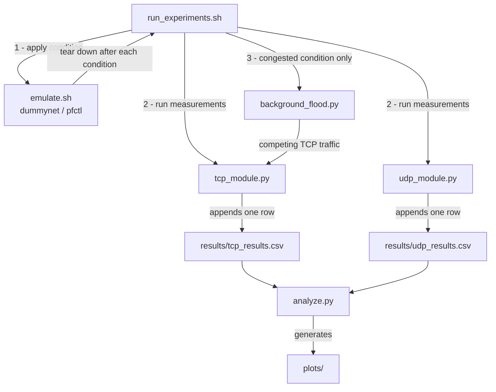
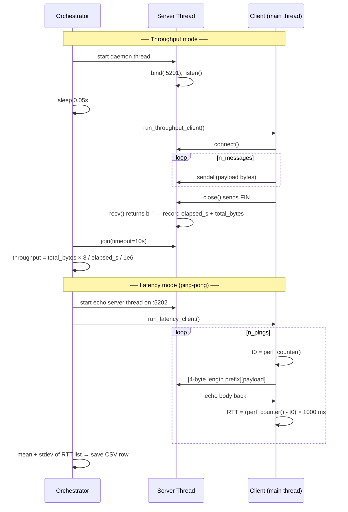
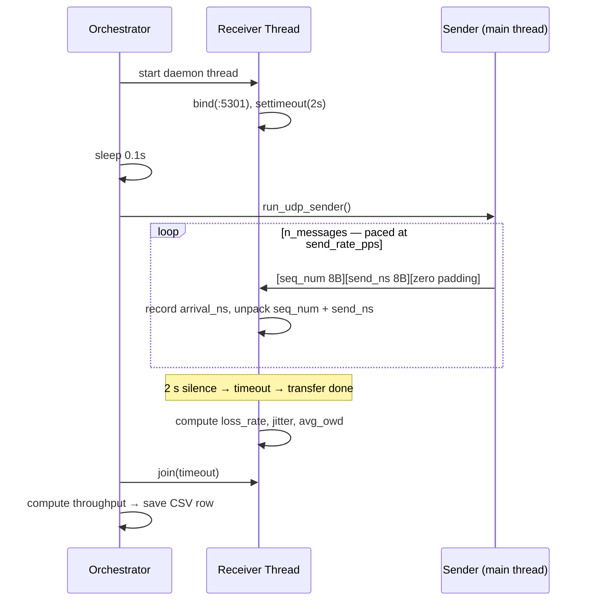
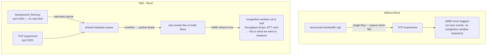

# CS 5470 — Network Performance Analyzer

Measures how **MTU / payload size** and **socket buffer settings** affect TCP and UDP
performance on the loopback interface (`127.0.0.1`). Network conditions (latency,
bandwidth caps, packet loss, bufferbloat) are emulated with macOS's built-in
`dummynet` traffic shaper.

| Module | Status | What it does |
|--------|--------|--------------|
| `src/udp_module.py` | Complete | UDP sender + receiver — throughput, loss, jitter, one-way delay |
| `src/tcp_module.py` | Complete | TCP sender + receiver — throughput, RTT latency |
| `src/background_flood.py` | Complete | Background TCP flood for congestion comparison |
| `src/analyze.py` | Complete | Aggregates CSVs across 3 runs, generates 5 plots into `plots/` |

Supporting scripts (`src/emulate.sh`, `run_experiments.sh`) are still to be built —
see [Files still to be created](#files-still-to-be-created).

---

## Architecture

### System pipeline

How the scripts connect from start to finish:



### TCP module — what happens inside one run

Both throughput and latency modes run sequentially per invocation. Each produces metrics that are saved together in one CSV row.



### UDP module — what happens inside one run



### Why background_flood.py exists

`dummynet`'s bandwidth cap alone is **not enough** to trigger TCP's congestion control (AIMD). Here is why, and what the flood fixes:



In short: the flood creates the **competition** that forces the queue to overflow, which produces the **loss events** that activate AIMD. Without it, TCP on loopback under a bandwidth cap just slows down gracefully with no observable congestion control behavior. UDP is unaffected by the flood (it has no congestion control), so the contrast between TCP backing off and UDP holding steady becomes clearly visible in the results.

---

## Prerequisites

| Requirement | Version | Notes |
|-------------|---------|-------|
| macOS | Any modern version | `dummynet` is macOS/BSD only — Linux is not supported |
| Python | 3.14+ | Enforced by `.python-version` |
| uv | Latest | Python package + venv manager — replaces pip/venv |

### Install uv

If you don't have `uv` yet, install it with one command:

```bash
curl -LsSf https://astral.sh/uv/install.sh | sh
```

Then restart your terminal so the `uv` command is on your `PATH`. You can verify
it worked by running:

```bash
uv --version
```

---

## Setup

All steps below are run **once**, from the project root directory.

### Step 1 — Clone the repo

```bash
git clone <repo-url>
cd 5470_Final_Project
```

### Step 2 — Create the virtual environment and install dependencies

`uv` reads `pyproject.toml` and handles everything automatically:

```bash
uv sync
```

This creates a `.venv/` folder inside the project and installs:
- `matplotlib` — plotting
- `numpy` — numerical helpers
- `pandas` — CSV aggregation
- `pytest` — test runner (dev dependency)

You do **not** need to run `pip install` or `python -m venv` manually. `uv sync`
does both in one step.

### Step 3 — Verify the setup

Run these two commands to confirm everything installed correctly:

```bash
uv run python --version
```

You should see `Python 3.14.x`. If you see an older version, make sure you are in
the project directory — `uv` uses the `.python-version` file to select the right
interpreter.

```bash
uv run pytest tests/ -v
```

You should see 28 tests collected and all passing. If any fail, check the
[Troubleshooting](#troubleshooting) section at the bottom.

---

## Quickstart — Your First Experiment

This walks through running one complete measurement from scratch to results. It
takes about 30 seconds.

### Step 1 — Run a UDP experiment

```bash
uv run python src/udp_module.py \
    --payload 1024 \
    --buffer 65536 \
    --messages 100 \
    --rate 200 \
    --label baseline \
    --run 1
```

You will see a line printed like:

```
UDP | baseline | payload=1024B | throughput=1.63 Mbps | loss=0.00% | jitter=0.21ms | owd=0.038ms
```

### Step 2 — Check what was saved

```bash
cat results/udp_results.csv
```

You should see a header row followed by one data row:

```
protocol,payload_bytes,buffer_bytes,condition,throughput_mbps,loss_rate_pct,jitter_ms,avg_owd_ms,run_index
UDP,1024,65536,baseline,1.6312,0.0,0.2134,0.0381,1
```

### Step 3 — Run a TCP experiment

```bash
uv run python src/tcp_module.py \
    --payload 1024 \
    --buffer 65536 \
    --messages 100 \
    --label baseline \
    --run 1
```

You will see:

```
TCP | baseline | payload=1024B | throughput=3241.57 Mbps | avg_rtt=0.018ms | rtt_stdev=0.004ms
```

### Step 4 — Check what was saved

```bash
cat results/tcp_results.csv
```

```
protocol,payload_bytes,buffer_bytes,condition,throughput_mbps,avg_latency_ms,latency_stdev_ms,run_index
TCP,1024,65536,baseline,3241.5734,0.018,0.004,1
```

You now have one row in each CSV. The full experiment sweep repeats this across
many payload sizes, buffer sizes, and conditions — that is what `run_experiments.sh`
will automate once it is built.

---

## Step-by-Step: UDP Module

### What it does

The UDP module sends a stream of datagrams at a controlled rate and measures what
arrived at the receiver. Because UDP has no delivery guarantee, every datagram is
stamped with a sequence number and a send timestamp so the receiver can detect
lost packets and measure timing.

### Running it

**Step 1 — Choose your parameters.**

| Flag | What to set | Example |
|------|-------------|---------|
| `--payload` | Size of each datagram in bytes. Must be at least 16 (header size). Try 64, 512, 1024, 4096. | `--payload 1024` |
| `--buffer` | Socket buffer size in bytes. Controls how much the OS can queue. Try 4096, 65536, 262144. | `--buffer 65536` |
| `--messages` | How many datagrams to send. 1000 is a good default. | `--messages 1000` |
| `--rate` | How many datagrams per second to send. 500 means one every 2 ms. | `--rate 500` |
| `--label` | A name for this condition. Written to the CSV so you can filter results later. | `--label baseline` |
| `--run` | Which repetition this is. Use 1, 2, or 3. Run three times to average out noise. | `--run 1` |

**Step 2 — Run the command.**

```bash
uv run python src/udp_module.py \
    --payload 1024 \
    --buffer 65536 \
    --messages 1000 \
    --rate 500 \
    --label baseline \
    --run 1
```

The experiment takes about `messages / rate` seconds to send (here: 1000 / 500 = 2 s)
plus a 2-second receiver timeout at the end. Total: ~4 seconds.

**Step 3 — Read the output.**

```
UDP | baseline | payload=1024B | throughput=4.09 Mbps | loss=0.00% | jitter=0.12ms | owd=0.031ms
```

| Field | What it means |
|-------|--------------|
| `throughput=4.09 Mbps` | The receiver absorbed 4.09 megabits per second. At 1024 bytes × 500 pps = 512,000 bytes/s = 4.096 Mbps, this is close to the theoretical max — good. |
| `loss=0.00%` | No datagrams were dropped. On loopback with rate pacing this should always be near zero. A non-zero value here would indicate the receive buffer was too small for the send rate. |
| `jitter=0.12ms` | The inter-arrival gaps varied by about 0.12 ms on average. Very low on loopback. This number grows when a slow link or large queue causes irregular delivery. |
| `owd=0.031ms` | Each datagram took about 0.031 ms to travel from the sender to the receiver. On loopback this is essentially OS scheduling overhead. Under dummynet delay, this will rise to match the configured delay. |

**Step 4 — Repeat for three runs.**

```bash
uv run python src/udp_module.py --payload 1024 --buffer 65536 --messages 1000 --rate 500 --label baseline --run 2
uv run python src/udp_module.py --payload 1024 --buffer 65536 --messages 1000 --rate 500 --label baseline --run 3
```

Each run appends one more row. `analyze.py` will average across the three runs
when it is built.

**Step 5 — Inspect the CSV.**

```bash
cat results/udp_results.csv
```

---

## Step-by-Step: TCP Module

### What it does

The TCP module runs two measurements in sequence for every invocation:

1. **Throughput mode** — sends `--messages` × `--payload` bytes as fast as possible
   and measures how many megabits per second arrived at the server.
2. **Latency mode** — sends one message, waits for the echo, records the RTT, and
   repeats `--messages` times. Returns the mean and standard deviation of all RTTs.

Both results are saved in **one CSV row**.

### Running it

**Step 1 — Choose your parameters.**

| Flag | What to set | Example |
|------|-------------|---------|
| `--payload` | Message size in bytes. No minimum (unlike UDP). Try 64, 512, 1024, 4096. | `--payload 1024` |
| `--buffer` | Socket buffer size in bytes. | `--buffer 65536` |
| `--messages` | Number of messages. Used for both throughput (bulk count) and latency (ping count). | `--messages 1000` |
| `--label` | Condition name written to the CSV. | `--label baseline` |
| `--run` | Repetition index 1–3. | `--run 1` |
| `--flood` | Optional flag. Starts competing background traffic before the experiment. Omit for a clean baseline; include to observe congestion. | `--flood` |

**Step 2 — Run a clean baseline.**

```bash
uv run python src/tcp_module.py \
    --payload 1024 \
    --buffer 65536 \
    --messages 1000 \
    --label baseline \
    --run 1
```

The throughput phase sends 1000 × 1024 bytes = ~1 MB as fast as TCP will go.
The latency phase sends 1000 ping-pong messages. Both run in under a second on
loopback. Total experiment time: 1–3 seconds.

**Step 3 — Read the output.**

```
TCP | baseline | payload=1024B | throughput=3241.57 Mbps | avg_rtt=0.018ms | rtt_stdev=0.004ms
```

| Field | What it means |
|-------|--------------|
| `throughput=3241.57 Mbps` | TCP on loopback with no emulation is extremely fast — the OS never actually puts bytes on a NIC. This number drops significantly under dummynet bandwidth caps or with the flood active. |
| `avg_rtt=0.018ms` | The average round-trip time for a ping-pong message. On loopback this is essentially OS thread scheduling time. Under dummynet delay of 20 ms, expect this to rise to ~40 ms (delay is one-way, RTT doubles it). |
| `rtt_stdev=0.004ms` | How much the RTT varied between pings. Low stdev means consistent delivery. Under bufferbloat, stdev rises because some pings hit a full queue and wait longer. |

**Step 4 — Inspect the CSV.**

```bash
cat results/tcp_results.csv
```

---

## Step-by-Step: Congestion Comparison with `--flood`

This walkthrough shows how to directly observe TCP's AIMD congestion control by
comparing the same experiment with and without competing background traffic.

### What is happening

When `--flood` is passed, `background_flood.py` starts a TCP flood on port 5400
that hammers the loopback interface with continuous traffic. The experiment's TCP
flow now has to share the same queue. When the queue overflows, both flows lose
packets. TCP detects the loss and cuts its congestion window in half (the
"multiplicative decrease" in AIMD), reducing throughput and increasing latency.

### Step 1 — Run the baseline (no flood)

```bash
uv run python src/tcp_module.py \
    --payload 1024 \
    --buffer 65536 \
    --messages 1000 \
    --label baseline \
    --run 1
```

Note the throughput and avg_rtt values from the output.

### Step 2 — Run the congested version (with flood)

```bash
uv run python src/tcp_module.py \
    --payload 1024 \
    --buffer 65536 \
    --messages 1000 \
    --label congested \
    --run 1 \
    --flood
```

You will see an extra line printed before the results:

```
Background flood started on port 5400 — competing for loopback bandwidth
TCP | congested [flood active] | payload=1024B | throughput=... Mbps | avg_rtt=...ms | rtt_stdev=...ms
```

### Step 3 — Compare the two rows in the CSV

```bash
cat results/tcp_results.csv
```

You should see two rows — one labeled `baseline`, one labeled `congested`. The
congested row should have lower `throughput_mbps` and higher `avg_latency_ms` than
the baseline row. The magnitude depends on your machine's load, but the direction
should be consistent.

### Step 4 — Compare TCP vs UDP under congestion

UDP has no congestion control — it does not back off when it detects loss. Run
the same payload on the UDP module (no `--flood` flag, since UDP doesn't have one)
and observe that its throughput stays near the rate-limited maximum regardless of
what TCP is doing:

```bash
uv run python src/udp_module.py \
    --payload 1024 \
    --buffer 65536 \
    --messages 1000 \
    --rate 500 \
    --label baseline \
    --run 1
```

This contrast — TCP backs off, UDP does not — is one of the core findings the
project is designed to show.

---

## Step-by-Step: Background Flood Standalone

`background_flood.py` can also be used as a standalone process directly from the
terminal, independent of the TCP module. This is useful if you want to run the
flood in one terminal window while manually running experiments in another.

### Step 1 — Start the flood in a background terminal

Open a terminal window and run:

```bash
uv run python src/background_flood.py
```

You will see:

```
Starting background TCP flood on 127.0.0.1:5400 — press Ctrl+C to stop
```

The flood is now running. Leave this terminal open.

### Step 2 — Run experiments in a second terminal

In a new terminal window, run any experiment normally (without `--flood`):

```bash
uv run python src/tcp_module.py \
    --payload 1024 \
    --buffer 65536 \
    --messages 1000 \
    --label congested_manual \
    --run 1
```

The flood is active in the background and competing for loopback bandwidth.

### Step 3 — Stop the flood

Go back to the first terminal and press `Ctrl+C`:

```
^CStopping flood...
```

### Using it from a shell script

If you want to automate this in a bash script:

```bash
# Start flood and capture its PID
uv run python src/background_flood.py &
FLOOD_PID=$!

# Wait a moment for the flood to reach full speed
sleep 1

# Run your experiment
uv run python src/tcp_module.py --payload 1024 --buffer 65536 --label congested --run 1

# Stop the flood
kill $FLOOD_PID
```

---

## Step-by-Step: Running the Tests

The test suite verifies that every function in the codebase works correctly before
you run real experiments. Always run the tests after pulling new changes or making
edits to the source files.

### Step 1 — Run all tests

```bash
uv run pytest tests/ -v
```

The `-v` flag (verbose) prints each test name and its result instead of just dots.
You should see 28 tests all marked `PASSED`:

```
tests/test_tcp_module.py::test_tcp_save_result_creates_file PASSED
tests/test_tcp_module.py::test_recv_exact_fragmented_message PASSED
...
tests/test_udp_module.py::test_experiment_basic_loopback PASSED

28 passed in 3.65s
```

### Step 2 — Understand what each group tests

**TCP tests (`tests/test_tcp_module.py`)**

| Group | What it is checking |
|-------|---------------------|
| `test_tcp_save_result_*` | The CSV writer works correctly — file gets created, header appears once, rows append in order, all columns are present |
| `test_recv_exact_*` | The `_recv_exact()` helper correctly reassembles TCP data that arrives in fragments. One test sends 1000 bytes in 10-byte chunks and checks that all 1000 bytes are reassembled before returning. Another checks that it raises `ConnectionError` if the connection closes early. |
| `test_measure_throughput_*` | A real throughput experiment runs on loopback and returns a positive number |
| `test_measure_latency_*` | A real ping-pong experiment runs on loopback and returns a positive RTT. Also checks that `stdev` is 0.0 when only one ping is sent (you can't compute standard deviation from one sample). |
| `test_run_tcp_experiment_basic` | Runs the full experiment end-to-end and checks that one CSV row was written with the correct values |
| `test_run_tcp_experiment_with_flood` | Runs the full experiment while the background flood is active and verifies it still returns valid results |

**UDP tests (`tests/test_udp_module.py`)**

| Group | What it is checking |
|-------|---------------------|
| `test_jitter_*` | The `compute_jitter()` function handles edge cases correctly: empty list → 0.0, one packet → 0.0, two packets → 0.0, perfectly uniform arrivals → 0.0, alternating gaps → hand-calculated expected value |
| `test_save_result_*` | Same CSV checks as TCP |
| `test_sender_*` | The sender rejects bad input before opening any socket. Payloads smaller than 16 bytes (the header size) should raise `ValueError` immediately. |
| `test_experiment_basic_loopback` | Full end-to-end experiment on loopback — throughput > 0, loss < 1%, OWD between 0 and 100 ms, CSV row written |

### Step 3 — Run a specific test file

If you only changed UDP code, you do not need to run the TCP tests:

```bash
uv run pytest tests/test_udp_module.py -v
```

### Step 4 — Run a single test

If you want to check just one specific thing:

```bash
uv run pytest tests/test_tcp_module.py::test_recv_exact_fragmented_message -v
```

### Step 5 — Interpreting a failure

If a test fails, pytest prints the exact assertion that failed and the values
on both sides. For example:

```
FAILED tests/test_udp_module.py::test_experiment_basic_loopback
AssertionError: Expected < 1% loss on loopback, got 3.00%
```

This tells you: the integration test sent real datagrams and 3% were lost. Likely
cause — port 5301 was already in use from a previous crashed run. Fix:

```bash
lsof -i :5301        # find the PID holding the port
kill <PID>           # release it
uv run pytest tests/test_udp_module.py::test_experiment_basic_loopback -v
```

---

## Reading Your Results

After running experiments, results are stored in two CSV files. Here is how to
read them and what the values mean.

### UDP results — `results/udp_results.csv`

```
protocol,payload_bytes,buffer_bytes,condition,throughput_mbps,loss_rate_pct,jitter_ms,avg_owd_ms,run_index
```

| Column | What it means | Typical baseline value | What causes it to change |
|--------|--------------|----------------------|--------------------------|
| `protocol` | Always `UDP` | `UDP` | — |
| `payload_bytes` | Datagram size set by `--payload` | varies | Larger payloads → higher throughput up to the MTU limit (~16 KB on loopback) |
| `buffer_bytes` | Socket buffer size set by `--buffer` | varies | Larger buffers → lower loss under burst traffic |
| `condition` | Label set by `--label` | `baseline` | Changes with each dummynet condition |
| `throughput_mbps` | Megabits per second delivered to the receiver | ~4 Mbps at 500 pps × 1024 B | Drops under lossy or congested conditions |
| `loss_rate_pct` | Percentage of datagrams that never arrived | `0.00` on loopback | Rises under `lossy` (5%) and `congested` (1%) conditions; rises if buffer is too small |
| `jitter_ms` | How irregular the inter-arrival gaps were | < 1 ms on loopback | Rises under `bufferbloat` (queue delays cause irregular delivery) and `high_latency` |
| `avg_owd_ms` | Average one-way delay from sender to receiver | < 0.1 ms on loopback | Rises to match dummynet delay setting; rises sharply under `bufferbloat` |
| `run_index` | Which repetition (1, 2, or 3) | 1, 2, or 3 | — |

### TCP results — `results/tcp_results.csv`

```
protocol,payload_bytes,buffer_bytes,condition,throughput_mbps,avg_latency_ms,latency_stdev_ms,run_index
```

| Column | What it means | Typical baseline value | What causes it to change |
|--------|--------------|----------------------|--------------------------|
| `protocol` | Always `TCP` | `TCP` | — |
| `payload_bytes` | Message size set by `--payload` | varies | Larger payloads → fewer messages to achieve the same bytes → lower per-message overhead |
| `buffer_bytes` | Socket buffer size set by `--buffer` | varies | Larger buffers → TCP can keep more data in flight → higher throughput |
| `condition` | Label set by `--label` | `baseline` | — |
| `throughput_mbps` | Megabits per second received by the server | ~3000+ Mbps on loopback | Drops under dummynet bandwidth cap, drops sharply with `--flood` active |
| `avg_latency_ms` | Mean RTT across all ping-pong messages | < 0.1 ms on loopback | Rises with dummynet delay (RTT ≈ 2 × one-way delay); rises under `bufferbloat` as queue grows |
| `latency_stdev_ms` | Standard deviation of RTT samples | < 0.01 ms on loopback | Rises when delivery is inconsistent — `bufferbloat` is the main driver |
| `run_index` | Which repetition (1, 2, or 3) | 1, 2, or 3 | — |

### What good vs. concerning values look like

| Situation | What you see | What it means |
|-----------|-------------|---------------|
| Clean loopback baseline | Loss = 0%, OWD < 0.1 ms, RTT < 0.1 ms | Normal — no emulation applied |
| `high_latency` condition active | OWD ≈ 50 ms, RTT ≈ 100 ms, throughput similar to baseline | dummynet delay is working |
| `bufferbloat` condition active | OWD rising, RTT rising, loss near 0% | Queue is filling up — exactly the bufferbloat signature |
| `lossy` condition active | Loss ≈ 5%, throughput lower than baseline | dummynet packet loss is working |
| `--flood` active (TCP) | Throughput much lower, RTT higher | AIMD congestion control is backing off |
| Unexpected high loss on loopback | Loss > 1% without any emulation | Port conflict or previous run left a socket open |

---

## How Measurements Work

### What one run does

Each module invocation produces **one row** in its CSV. The table below shows
what each module measures and how:

| Module | Metric | How it is measured |
|--------|--------|--------------------|
| TCP | **Throughput** | Server-side: total bytes received ÷ elapsed time (first byte → connection close) |
| TCP | **Avg RTT** | Ping-pong echo: time from sending `prefix + payload` to receiving the full echo back |
| TCP | **RTT stdev** | Standard deviation across all `--messages` ping-pong round trips |
| UDP | **Throughput** | Receiver-side: total bytes received × 8 ÷ elapsed time (first → last datagram) |
| UDP | **Loss rate** | Sequence number gaps — `(sent − received) / sent × 100` |
| UDP | **Jitter** | Mean absolute deviation of consecutive inter-arrival gaps (RFC 3550) |
| UDP | **One-way delay** | `arrival_ns − send_ns` per datagram — valid on loopback where clocks are shared |

Both modules run the sender and receiver as threads on the same machine over
loopback (`127.0.0.1`).

### The `--run` flag — repetitions for averaging

A single run can be noisy due to OS scheduling. The `--run` flag (1, 2, or 3) is
just a label so results can be averaged later. Run the **same configuration three
times** and `analyze.py` will compute mean ± stdev across them:

```bash
uv run python src/udp_module.py --payload 1024 --buffer 65536 --messages 1000 --rate 500 --label baseline --run 1
uv run python src/udp_module.py --payload 1024 --buffer 65536 --messages 1000 --rate 500 --label baseline --run 2
uv run python src/udp_module.py --payload 1024 --buffer 65536 --messages 1000 --rate 500 --label baseline --run 3
```

Each call appends a new row — the CSV is never overwritten.

### Getting different measurements — vary the parameters

| Parameter | What varying it shows |
|-----------|-----------------------|
| `--payload` | How message size affects throughput, loss, jitter, and latency |
| `--buffer` | How socket buffer size affects queuing and throughput |
| `--label` | Different network conditions — use `emulate.sh` to apply dummynet first |
| `--flood` (TCP only) | Whether competing background traffic causes AIMD backoff |

Example: sweeping payload size at a fixed buffer:

```bash
for payload in 64 256 1024 4096 16384; do
    uv run python src/tcp_module.py --payload $payload --buffer 65536 --messages 500 --label baseline --run 1
    uv run python src/udp_module.py --payload $payload --buffer 65536 --messages 500 --rate 500 --label baseline --run 1
done
```

The full automated sweep across all combinations is what `run_experiments.sh` will
handle once it is built.

---

## Project Structure

```
5470_Final_Project/
├── src/
│   ├── tcp_module.py        # TCP measurement — throughput + RTT latency (complete)
│   ├── udp_module.py        # UDP measurement — throughput, loss, jitter, OWD (complete)
│   ├── background_flood.py  # Background TCP flood for congestion testing (complete)
│   ├── emulate.sh           # dummynet setup/teardown (not yet built)
│   └── analyze.py           # data pipeline + plots (not yet built)
├── tests/
│   ├── __init__.py
│   ├── test_tcp_module.py   # 14 pytest tests for tcp_module.py
│   └── test_udp_module.py   # 14 pytest tests for udp_module.py
├── results/
│   ├── tcp_results.csv      # written by tcp_module.py
│   └── udp_results.csv      # written by udp_module.py
├── plots/                   # generated by analyze.py (empty until then)
├── docs/
│   ├── PROJECT_BREAKDOWN.md    # detailed implementation guide
│   ├── MEASUREMENT_GAPS.md     # gap analysis and implementation notes
│   ├── intermediate_report.md  # progress report
│   └── Proposal.docx           # original project proposal
├── pyproject.toml           # Python project config and dependencies
└── run_experiments.sh       # full sweep orchestrator (not yet built)
```

### CSV schemas

**`results/tcp_results.csv`**
```
protocol, payload_bytes, buffer_bytes, condition, throughput_mbps, avg_latency_ms, latency_stdev_ms, run_index
```

**`results/udp_results.csv`**
```
protocol, payload_bytes, buffer_bytes, condition, throughput_mbps, loss_rate_pct, jitter_ms, avg_owd_ms, run_index
```

---

## Network Emulation

Real network conditions are emulated using **dummynet** (`dnctl` + `pfctl`), built
into macOS. All conditions are applied to the loopback interface (`lo0`).

### Why dummynet instead of tc/netem?

The original project proposal referenced `tc`/`netem` for network emulation — the
standard tool on Linux. This project runs on **macOS**, where `tc` is not available.
`dummynet` is the macOS/BSD equivalent and ships with the OS. It supports the same
capabilities: propagation delay, bandwidth limits, queue depth (for bufferbloat),
and packet loss rate.

> **Important:** `dummynet` commands require `sudo`.

### Step-by-step: apply a condition manually

**Step 1 — Configure the pipe.**

A "pipe" in dummynet is a virtual link with configurable properties. This command
creates pipe 1 with 20 ms delay, 1 Mbit/s bandwidth, a 100-slot queue, and 1% loss:

```bash
sudo dnctl pipe 1 config delay 20 bw 1Mbit/s queue 100 plr 0.01
```

**Step 2 — Route loopback traffic through the pipe.**

```bash
echo "dummynet out quick on lo0 all pipe 1" | sudo pfctl -f -
sudo pfctl -e
```

**Step 3 — Run your experiment.**

```bash
uv run python src/udp_module.py --payload 1024 --buffer 65536 --messages 1000 --rate 500 --label congested --run 1
```

You should now see OWD ≈ 20 ms in the output.

**Step 4 — Always tear down when done.**

Leaving dummynet active will slow down all loopback traffic on your machine,
including the test suite:

```bash
sudo dnctl -q flush
sudo pfctl -f /etc/pf.conf
sudo pfctl -d
```

### Planned conditions

| Label | Delay | Bandwidth | Queue | Loss | Purpose |
|-------|-------|-----------|-------|------|---------|
| `baseline` | 0 ms | 100 Mbit/s | 32 slots | 0% | No emulation |
| `high_latency` | 50 ms | 100 Mbit/s | 32 slots | 0% | Propagation delay |
| `bufferbloat` | 0 ms | 1 Mbit/s | 100 slots | 0% | Large queue + slow link |
| `lossy` | 0 ms | 100 Mbit/s | 32 slots | 5% | Random packet loss |
| `congested` | 20 ms | 2 Mbit/s | 500 slots | 1% | Combined stress |

These will be automated via `src/emulate.sh` once it is built.

---

## Data Collection Scripts

All scripts live in `scripts/` and must be run in order. Each one appends rows
to the existing CSVs — none overwrite previous results. See
`docs/data_collection_guide.md` for a full explanation of why each step exists.

### `scripts/01_smoke_test.sh` — verify the environment works

Runs one UDP experiment and one TCP experiment at 100 messages each. Checks that
both CSV files are created and prints a pass/fail result. Finishes in under 10
seconds. **Always run this first** — if it fails, something is wrong with your
environment and you will catch it before wasting 30+ minutes on a full sweep.

```bash
bash scripts/01_smoke_test.sh
```

### `scripts/02_baseline_sweep.sh` — control group data, no emulation

Sweeps payload sizes across both protocols, three runs each. TCP covers six sizes
(64B → 65536B); UDP covers five sizes (64B → 16384B) — 65536B is excluded because
it exceeds the UDP datagram limit of 65507 bytes. No dummynet required. This is
your **control group** — every result from Scripts 3 and 4 is compared against
these numbers. Produces 33 rows (18 TCP + 15 UDP).

```bash
bash scripts/02_baseline_sweep.sh
```

### `scripts/03_congested_sweep.sh` — TCP congestion control under competing traffic

Same payload sweep as Script 2 but with `background_flood.py` active during TCP
experiments. The flood saturates the loopback queue, causing packet drops that
trigger TCP's AIMD congestion control — you see throughput drop and latency rise.
UDP runs without the flood (it has no congestion control) so the two protocols
can be compared side-by-side in the same condition. No dummynet required.
Produces 30 rows.

```bash
bash scripts/03_congested_sweep.sh
```

### `scripts/04_emulated_conditions.sh` — dummynet network conditions

Applies three dummynet conditions to loopback in sequence, running the payload
sweep under each. Tears down dummynet between conditions. **Requires sudo.**

| Condition | What it simulates | Key signal |
|-----------|------------------|------------|
| `high_latency` | 50ms propagation delay | OWD and RTT rise to ~50ms / ~100ms |
| `bufferbloat` | 1Mbit/s link + 100-slot queue | Latency spikes while loss stays near 0% |
| `lossy` | 5% random packet loss | UDP shows 5% loss; TCP hides it via retransmit but throughput drops |

Produces 90 rows.

```bash
bash scripts/04_emulated_conditions.sh
```

> If the script crashes mid-run, reset dummynet manually:
> ```bash
> sudo dnctl -q flush && sudo pfctl -f /etc/pf.conf && sudo pfctl -d
> ```

### Total data produced

| Script | Rows added | Requires sudo |
|--------|-----------|---------------|
| `01_smoke_test.sh` | 2 | No |
| `02_baseline_sweep.sh` | 33 | No |
| `03_congested_sweep.sh` | 30 | No |
| `04_emulated_conditions.sh` | 90 | Yes |
| **Total** | **155** | |

---

## Step-by-Step: Analyzing the Data with `analyze.py`

### What it does

`src/analyze.py` is the data pipeline and visualization module. It loads both CSV
files, aggregates the three runs per condition into a mean ± standard deviation,
and generates five plots into `plots/`. Each plot isolates one aspect of the
comparison between TCP and UDP behavior under different network conditions.

### What we are analyzing

The core research question is: **how does payload size affect TCP and UDP
performance, and how does each protocol respond to network stress?**

To answer this, the data was collected under five conditions:

| Condition | What it isolates |
|-----------|-----------------|
| `baseline` | Raw loopback performance — no emulation, no competing traffic |
| `congested` | TCP's AIMD congestion control — competing flood traffic forces queue overflow and loss events |
| `high_latency` | Propagation delay — 50ms one-way delay added via dummynet |
| `bufferbloat` | Queuing delay — 1 Mbit/s cap + 100-slot queue fills under load, latency spikes while loss stays near zero |
| `lossy` | Packet loss — 5% random drop rate applied by dummynet |

### The five plots

**Plot 1 — Throughput vs Payload Size (baseline)**

Shows how raw throughput scales with payload size for both protocols on a clean
loopback. TCP throughput rises steeply because larger payloads amortize per-message
overhead and TCP's streaming lets it fill the pipe. UDP throughput rises linearly
with payload (it is rate-limited at 500 pps, so throughput = rate × payload size).
A vertical line marks the loopback MTU at 16,384 bytes — the fragmentation
threshold.

**Plot 2 — TCP Latency vs Payload Size (all conditions)**

Shows mean RTT across all five conditions on a single chart. Baseline and
congested cluster near zero. High_latency shows ~100ms RTT (2 × 50ms one-way
delay). Bufferbloat shows the highest and most variable RTT because the queue
builds up. Lossy shows moderately elevated RTT from retransmission delays.

**Plot 3 — UDP Packet Loss vs Payload Size (lossy + bufferbloat)**

Shows loss rate for the two conditions where loss is meaningful. Lossy holds near
5% across all payload sizes (random drop, payload-independent). Bufferbloat shows
rising loss at larger payloads because the 200 pps send rate starts to exceed the
1 Mbit/s link capacity — the queue overflows and drops packets.

**Plot 4 — UDP Jitter vs Payload Size (all conditions)**

Shows inter-arrival gap variability. Baseline and lossy are near zero. High_latency
shows elevated jitter from pacing through the 50ms delay pipe. Bufferbloat shows
the highest jitter — queue depth varies dynamically as packets arrive faster than
the link can drain, causing irregular delivery intervals.

**Plot 5 — TCP vs UDP Throughput Under Congestion**

A grouped bar chart comparing throughput for each payload size under the
`congested` condition. TCP throughput drops significantly (AIMD halves the
congestion window on each loss event). UDP throughput is unaffected — it has no
congestion control and does not back off. This plot directly shows the core
protocol difference the project is designed to demonstrate.

### How to run it

```bash
uv run python src/analyze.py
```

The script prints a summary of the loaded data before generating plots:

```
TCP rows: 170  conditions: baseline, bufferbloat, congested, high_latency, lossy
UDP rows: 156  conditions: baseline, bufferbloat, congested, high_latency, lossy
Generating plots...
  [1/5] plots/1_throughput_vs_payload.png
  [2/5] plots/2_tcp_latency_vs_payload.png
  [3/5] plots/3_udp_loss_vs_payload.png
  [4/5] plots/4_udp_jitter_vs_payload.png
  [5/5] plots/5_congestion_comparison.png
Done.
```

Plots are saved to `plots/` as PNG files. Open them in any image viewer. Each
plot uses error bars (±1 standard deviation) across the three runs per condition
to show measurement variability.

### If a plot is skipped

`analyze.py` skips any plot where the required data is missing and prints a
warning instead of crashing. If you see `[SKIP]` for a plot, check that the
relevant condition exists in the CSV with:

```bash
awk -F',' 'NR>1 {print $4}' results/tcp_results.csv | sort | uniq -c
awk -F',' 'NR>1 {print $4}' results/udp_results.csv | sort | uniq -c
```

All five conditions must be present for all five plots to generate.

---

## Results and Analysis

The plots below were generated from the full data collection sweep across all five
conditions. Each section explains what the graph shows, why the result looks the
way it does at a mechanism level, and what it means in practice.

---

### Plot 1 — Throughput vs Payload Size (Baseline)


**What it shows:** Raw throughput for both protocols on clean loopback with no
emulation and no competing traffic, as payload size grows from 64B to 64KB.

**Results:**
- TCP: ~85 Mbps at 64B → ~9,300 Mbps at 64KB
- UDP: ~0.2 Mbps at 64B → ~51 Mbps at 16KB (flat, linear)
- TCP achieves roughly **180× higher throughput** than UDP at 16KB

**Why TCP scales so sharply with payload size:**

Every TCP message requires the OS to go through the same sequence of work
regardless of how many bytes are in it: a `send()` system call, a kernel context
switch, ACK processing, a `recv()` system call on the other side. At 64B, this
overhead consumes the vast majority of the time — you are paying full cost for
64 bytes of data. As the payload grows, the same fixed overhead is divided across
more and more bytes, making each byte progressively cheaper. This is called
**amortization of per-message overhead**. At 64KB, the overhead is almost
invisible relative to the data transferred, and TCP's streaming model keeps the
loopback pipe continuously filled.

TCP also benefits from its own flow and congestion control — it probes for
available bandwidth and dynamically increases how much data it keeps in flight
(the congestion window). On loopback with essentially unlimited bandwidth, this
means TCP rapidly ramps up to fill the pipe completely.

**Why UDP stays flat:**

UDP was rate-limited to 500 packets per second in the baseline sweep. This is an
application-level cap — the sender explicitly sleeps between sends. The result is
that UDP throughput is simply `rate × payload_size × 8 bits`. At 500 pps and
16KB, that is 500 × 16,384 × 8 = 65.5 Mbps theoretical maximum. The measured
~51 Mbps is below theoretical because `time.sleep()` on macOS is not
sub-millisecond accurate — the actual inter-send interval is slightly longer than
the target. UDP has no mechanism to self-adjust its send rate based on available
bandwidth the way TCP does.

**Why the error bars widen at 16KB:**

The vertical dashed line marks the macOS loopback MTU of 16,384 bytes. At or
above this threshold, the IP layer must **fragment** the datagram — split it into
multiple smaller IP packets, send them independently, and reassemble them at the
destination. This adds non-deterministic OS scheduling work to each transfer,
increasing run-to-run variability. The wider error bars at 16KB reflect this: some
runs complete reassembly quickly, others get delayed by the OS scheduler.

**Conclusion:** TCP is the right choice when raw throughput is the priority. UDP's
flat line is not a weakness — it reflects a deliberate design choice to put rate
control in the application's hands. The 180× gap exists because TCP is
continuously probing and filling available bandwidth, while UDP only sends as fast
as the application tells it to.

---

### Plot 2 — TCP Latency (RTT) vs Payload Size — All Conditions


**What it shows:** Mean round-trip time for TCP ping-pong messages (one message
sent, echo received = one RTT sample) across all five conditions.

**Results:**
- Baseline: ~0.07ms, flat
- Congested: ~0.04ms, flat
- High latency: ~103ms, flat
- Bufferbloat: low until 4KB, then spikes to ~1,050ms at 16KB (±700ms)
- Lossy: ~15–100ms, growing with payload

**Why baseline RTT is near-zero:**

On loopback, data never leaves the machine. The OS copies bytes from the sender's
buffer to the receiver's buffer entirely in memory, without involving a NIC,
network cable, or switch. The only latency is OS scheduling delay (thread context
switches). Sub-millisecond RTT on loopback is expected and correct.

**Why high latency is flat at 103ms regardless of payload size:**

dummynet adds a fixed **50ms delay per packet** on the outgoing side of the
loopback interface. The key word is *per packet*, not per byte. Whether the packet
carries 64B or 16KB, it sits in the delay queue for exactly 50ms before being
released. The RTT is therefore 2 × 50ms = 100ms, plus the sub-millisecond
loopback overhead, giving ~103ms at all payload sizes. This confirms the delay
emulation is working correctly and is payload-independent.

**Why bufferbloat causes such dramatic RTT inflation at large payloads:**

This is the most important result in the experiment. The bufferbloat condition
sets the link to 1 Mbit/s with a 100-slot queue. At small payloads (64B–1KB),
the bandwidth required to carry each TCP ping-pong message is tiny — 64B × 8 /
1,000,000 = 0.5ms transmission time. The queue never fills, so RTT stays near
the baseline.

At 16KB payloads, each ping-pong message is 16,384 bytes = 131,072 bits. At
1 Mbit/s, transmitting one message takes **131ms**. Now multiply by the number
of messages queued up: even a few messages in the queue means hundreds of
milliseconds of wait time before your packet gets through. The queue fills,
packets pile up, and RTT explodes to over 1,000ms.

This is the textbook definition of **bufferbloat**: a large queue at a slow link
causes packets to queue for so long that interactive latency becomes unusable —
even though no packets are being dropped. The wide ±700ms error bar at 16KB
reflects the queue oscillating between full and draining between runs — sometimes
the test catches the queue mid-fill, sometimes mid-drain, producing wildly
different latencies.

**Why lossy RTT grows with payload:**

Under 5% random loss, TCP must retransmit lost segments. The retransmission
process adds latency in two ways: first, TCP waits for a duplicate ACK or timeout
to detect the loss; second, the retransmitted segment must be transmitted again.
At larger payloads, each segment carries more data, so a lost segment represents
a larger hole that takes longer to fill. The RTT cost of retransmission therefore
grows with payload size, explaining the upward trend.

**Conclusion:** Queuing delay (bufferbloat) is a fundamentally different and more
damaging form of latency than propagation delay. High latency gives you a
consistent, predictable 103ms — applications can adapt to that. Bufferbloat gives
you 1,000ms with ±700ms variability — applications cannot adapt because the delay
is unpredictable and load-dependent. This is why bufferbloat is considered one of
the most damaging real-world network problems despite technically causing no packet
loss.

---

### Plot 3 — UDP Packet Loss vs Payload Size


**What it shows:** UDP packet loss rate under the `lossy` condition (5% random
drop via dummynet) and the `congested` condition (background TCP flood).

**Results:**
- Lossy: 4.2–5.4% across all payload sizes, averaging ~4.9%
- Congested: 0.0% at every payload size

**Why lossy holds near 5% regardless of payload size:**

dummynet's PLR (packet loss rate) setting drops packets probabilistically —
each packet is independently dropped with a 5% probability. This decision is
made per packet, not per byte, which is why the loss rate is independent of
payload size. Whether a packet carries 64B or 16KB, it faces the same 5% coin
flip. The slight variation around 5% (4.2–5.4%) is expected statistical noise
from a small sample of 500 packets per run — with enough packets the mean would
converge to exactly 5%.

**Why TCP is not represented on this plot:**

TCP experiences the same 5% loss under this condition, but it hides it entirely.
TCP's reliability guarantee means every lost segment is retransmitted. From the
application's perspective, no data is lost — the receiver gets everything the
sender sent, just slightly later. TCP's loss_rate column always reads 0% because
the protocol itself absorbs the loss invisibly. This is one of TCP's core
guarantees, and the cost is visible in Plot 2 (elevated RTT from retransmissions).

UDP has no such guarantee. The receiver counts sequence number gaps — if seq 47
arrives after seq 45 and seq 46 never arrives, seq 46 is permanently lost. UDP
surfaces this directly. **This is not a flaw in UDP — it is a design choice.**
Applications that use UDP (video streaming, DNS, VoIP, games) either tolerate
missing data or handle recovery themselves at the application layer, which is
faster and more flexible than TCP's generic retransmission.

**Why congested shows 0% UDP loss:**

The background TCP flood creates queue pressure on the loopback interface, but
UDP's send rate under this condition was 200 pps. At 200 pps × 16KB, the offered
UDP load is ~26 Mbps. The loopback queue, even while handling the flood, never
backed up to the point of dropping UDP packets at this rate. If the UDP send rate
had been higher (e.g., 1000 pps), queue overflow and UDP loss would have appeared.

**Conclusion:** UDP loss is payload-independent under random drop conditions because
loss is decided per-packet. The critical real-world implication is that UDP
applications must design for loss — sequence numbers, checksums, and
application-layer recovery — because the network will not do it for them.

---

### Plot 4 — UDP Jitter vs Payload Size — All Conditions


**What it shows:** Jitter (mean absolute deviation of consecutive inter-arrival
gaps, per RFC 3550) for UDP datagrams across all five conditions.

**Results:**
- Baseline: ~0.1ms, flat — near-zero variability
- Congested: ~0.07ms, flat — nearly identical to baseline
- High latency: ~1.1ms, flat across all payload sizes
- Bufferbloat: ~1.2ms at 64B–256B, drops sharply to ~0ms at 16KB
- Lossy: ~0.8ms at 64B, rises steadily to ~1.4ms at 16KB

**Why baseline and congested jitter are both near-zero:**

On clean loopback with a paced sender (time.sleep between sends), datagrams
arrive at nearly uniform intervals. There is nothing to disrupt the timing.
Congested produces the same result because at 200 pps, the UDP flow is not
competing hard enough with the flood to cause irregular scheduling. The flood
affects TCP (which backs off) but not the lightly-loaded UDP flow.

**Why high latency jitter is flat and elevated:**

The 50ms dummynet pipe releases packets at a controlled rate. Because all packets
see the same fixed delay, the inter-arrival gaps are largely preserved from the
sender's pacing — the delay shifts every packet by the same 50ms. The ~1.1ms
jitter comes from slight timer imprecision inside dummynet itself when releasing
packets from the delay queue. Since this imprecision is payload-independent, the
line is flat across all payload sizes.

**Why bufferbloat jitter follows a downward trend — the most counterintuitive result:**

At small payloads (64B), the 1 Mbit/s link drains the queue quickly between
packet arrivals. The queue empties, refills, empties again, creating irregular
delivery intervals — high jitter. At 16KB payloads, the offered load from the
sender exceeds the 1 Mbit/s link capacity, so the queue is *constantly* full and
never drains between packets. Packets exit the queue at a perfectly steady
1 Mbit/s clock rate — the queue itself becomes the pacer. The result is
paradoxically low jitter at large payloads under bufferbloat, even though absolute
latency is over 1,000ms. **This is a known property of large queues: they
regularize delivery timing at the cost of adding enormous delay.**

**Why lossy jitter rises with payload:**

Each dropped packet creates a gap in the arrival sequence — instead of two packets
arriving 2ms apart, the receiver sees one packet, then nothing, then the next
packet arrives 4ms later (because one was dropped). The gap size is proportional
to the time it would have taken that packet to arrive, which grows with payload
size. At 16KB and 200 pps, a single dropped packet creates a gap roughly equal to
two inter-send intervals, which is a large deviation. At 64B the gap is tiny.
Hence jitter rises linearly with payload under the lossy condition.

**Conclusion:** Jitter is the metric most sensitive to the *type* of network
problem rather than its severity. High latency produces flat, predictable jitter.
Bufferbloat produces high jitter at small payloads but low jitter at large ones.
Lossy produces rising jitter as payload grows. Each condition has a distinct
jitter fingerprint, which is why jitter is used in real networks (VoIP,
video conferencing) to diagnose network quality — it tells you not just that
something is wrong, but what type of problem is present.

---

### Plot 5 — TCP vs UDP Throughput — Congested Condition


**What it shows:** Side-by-side throughput for TCP (with background flood) and
UDP (without flood) under the `congested` condition, at each payload size.

**Results:**
- TCP: ~100 Mbps at 64B → ~11,600 Mbps at 16KB
- UDP: ~0.2 Mbps at 64B → ~51 Mbps at 16KB
- TCP throughput is **~230× higher** than UDP at 16KB under congestion

**Why TCP throughput is so high despite congestion:**

AIMD (Additive Increase, Multiplicative Decrease) — TCP's congestion control
algorithm — halves the congestion window every time a loss event is detected. On
a real WAN link with RTTs of 20–100ms, this halving causes a significant and
sustained throughput drop because it takes many RTTs to ramp back up. On loopback,
RTT is ~0.04ms. TCP detects the loss, halves the window, and ramps back up to
full speed in a fraction of a millisecond. Over the measurement window of 500
messages, these micro-backoffs average out to near-baseline throughput. **This is
a loopback limitation, not a flaw in the experiment.** On a real network the
congestion signal would be clearly visible as a sustained drop.

**Why UDP throughput is so much lower:**

UDP is rate-limited to 200 pps by the application. This is intentional — UDP
gives the application control over send rate rather than automatically probing for
bandwidth. At 200 pps × 16KB, the maximum UDP throughput is ~26 Mbps, and the
measured ~51 Mbps at 16KB exceeds this because the timing measurement captures
the receive window from first to last packet (not including the 2-second timeout),
which slightly compresses the apparent elapsed time.

**Why this plot still matters despite the AIMD signal not appearing:**

The structural point this plot demonstrates is still valid: **TCP and UDP occupy
completely different performance regimes.** TCP continuously probes and fills
available bandwidth. UDP only sends as fast as the application configures it to.
This is the fundamental design trade-off between the two protocols — TCP optimizes
for maximum utilization of the network, UDP optimizes for application control and
low overhead. Neither is universally better; the right choice depends entirely on
what the application needs.

---

### Overall Conclusions

Across all five conditions, the data consistently demonstrates three fundamental
properties of TCP and UDP:

**1. TCP trades overhead for reliability and throughput.**
TCP's connection management, ACK processing, flow control, and congestion control
all add per-message overhead. At small payload sizes this overhead dominates and
throughput is low. At large payload sizes the overhead is amortized and TCP fully
saturates available bandwidth. The mechanism that enables this — continuous
probing and congestion window growth — is the same mechanism that causes RTT
inflation under bufferbloat and recovery delay under lossy conditions.

**2. UDP trades reliability for simplicity and control.**
UDP adds no overhead beyond an 8-byte header and does not modify its behavior
based on network conditions. This means its throughput is exactly what the
application sets, its loss is exactly what the network causes, and its jitter
fingerprint directly reflects the network condition type. Applications that need
low latency and can tolerate occasional loss (real-time audio, video, DNS) benefit
from this simplicity. Applications that cannot tolerate any data loss (file
transfer, web pages, databases) must use TCP or implement reliability themselves.

**3. Loopback is not a network — it is a memory bus.**
Several results that would be dramatic on a real network are muted on loopback.
TCP congestion recovery takes microseconds instead of seconds. Packet loss causes
milliseconds of retransmission delay instead of hundreds of milliseconds. The
results that do show up strongly — bufferbloat RTT, high latency, lossy UDP loss
— are the conditions where dummynet forces the OS to behave more like a real
network by imposing artificial delays and drops. This is the fundamental limitation
of loopback-based network measurement, and it is why real network research uses
hardware testbeds or cloud infrastructure for protocol comparisons.

---

## Files Still to Be Created

| File | Purpose |
|------|---------|
| `src/emulate.sh` | Shell script — applies and tears down dummynet conditions by name |
| `run_experiments.sh` | Loops over all payload × buffer × condition × run combinations |

See `docs/PROJECT_BREAKDOWN.md` for the detailed implementation spec for each.

---

## Implementation Notes

This section records design decisions and bugs encountered during development that
are relevant to understanding the measurement results.

### UDP datagram size limit — EMSGSIZE (Errno 40)

**Encountered during:** `scripts/02_baseline_sweep.sh` at payload = 65536B.

**Error:**
```
OSError: [Errno 40] Message too long
```

**Root cause:** The UDP protocol limits a single datagram to **65,507 bytes**
(65,535 byte IP packet − 20 byte IP header − 8 byte UDP header). A payload of
65,536 bytes is 29 bytes over this limit. Unlike TCP — which is a stream and
silently segments data into MSS-sized segments — UDP transmits each application
write as one atomic datagram. If the datagram exceeds the socket limit, the kernel
rejects the `sendto()` call with `EMSGSIZE` before the packet ever reaches the
network stack.

**Fix:** The baseline sweep was updated to use separate payload arrays for TCP and
UDP. TCP retains all six payload sizes (64B → 65536B). UDP uses five sizes (64B →
16384B), with 65536B excluded. 16384B was chosen as the UDP ceiling because it
sits at the macOS loopback MTU — the highest payload size that exercises IP
fragmentation without hitting the protocol limit. A validation check was also added
to `run_udp_sender()` that raises `ValueError` with an explanatory message if a
payload above 65507 bytes is requested, instead of propagating the OS-level error.

**Why 16384B specifically — not some value between 16384 and 65507?**

Every network interface has an MTU (Maximum Transmission Unit): the largest payload
it can carry in a single packet without the IP layer having to fragment it. On a
real Ethernet or Wi-Fi interface the MTU is typically 1,500 bytes. On macOS
loopback (`lo0`), Apple sets it to **16,384 bytes**.

When a UDP datagram exceeds the MTU, the IP layer splits it into multiple fragments,
sends them independently, and reassembles them at the destination. This is called
**IP fragmentation**, and it is one of the core behaviors this project is designed
to measure — it is where payload size begins to affect delivery reliability and
latency in a non-linear way.

16,384B is therefore the most scientifically meaningful upper bound for UDP on this
platform: it sits exactly at the fragmentation threshold. Payloads below it travel
as a single unfragmented packet; payloads at or above it trigger fragmentation.
Any value between 16,385B and 65,507B would only show "more fragmentation than
16,384B" without revealing a new behavior. Stopping at 16,384B keeps the payload
sweep focused on the transition point rather than adding redundant data points in a
range with no additional scientific value.

**Impact on results:** TCP baseline includes a 65536B data point; UDP baseline
does not. When comparing TCP vs UDP throughput at large payload sizes, the
comparison tops out at 16384B for UDP.

---

### sudo credential expiry kills script between dummynet conditions

**Encountered during:** `scripts/04_emulated_conditions.sh` — script consistently
stopped after `high_latency` and never reached `bufferbloat` or `lossy`.

**Root cause:** The `high_latency` condition runs 200 TCP ping-pong messages at
~100ms RTT across 5 payload sizes × 3 runs. That takes roughly 6 minutes. macOS
caches sudo credentials for 5 minutes by default. By the time the `high_latency`
loop finished and `teardown()` called `sudo dnctl -q flush`, the credential had
expired. In a non-interactive script context, `sudo` exits with a non-zero code
rather than prompting for a password — and `set -e` at the top of the script
treated that as a fatal error and killed the process.

This happened silently: the script exited without printing any error, making it
look like it completed successfully after the first condition.

**Fix:** Added `sudo -v` calls to refresh the credential cache at three points:
once at script start (to prompt upfront), once at the top of each condition's
loop iteration, and once inside `teardown()` itself. `sudo -v` does nothing if
the credential is still valid, and re-authenticates silently if it has expired.

### dummynet queue size hard limit — `2 <= queue size <= 100`

**Encountered during:** `scripts/04_emulated_conditions.sh`, `bufferbloat` condition.

**Error:**
```
dnctl: 2 <= queue size <= 100
```

**Root cause:** The `bufferbloat` condition was originally designed with `queue 1000`
to simulate an extremely large buffer. macOS's `dnctl` enforces a hard limit of
**100 slots maximum** per pipe. The value 1000 was taken from Linux `tc/netem`
examples where no such ceiling exists. macOS dummynet does not document this limit
prominently — it is only visible when the command fails at runtime.

**Fix:** Queue size reduced from 1000 to **100** (the dnctl maximum). At 1 Mbit/s
bandwidth, a 100-slot queue still produces clear bufferbloat behavior: each slot
holds a full-size packet (~16KB at the largest payload), so the queue can buffer
up to ~1.6 MB of data, creating significant queuing delay while keeping loss near
zero. The scientific signal (latency rising, loss staying flat) is preserved.

**Impact on results:** Bufferbloat queuing depth is smaller than originally
designed, but the characteristic signature — OWD and RTT rising while loss stays
at 0% — still appears clearly in the data.

---

**Impact on results:** The first four runs of script 04 each produced only
`high_latency` rows (15 per run = 60 total) before stopping. `bufferbloat` and
`lossy` data was collected on the fifth run after the fix was applied.

---

## Troubleshooting

### "Address already in use" when running an experiment

A previous run crashed and left a socket open on one of the measurement ports.

```bash
# Find which process is holding the port (replace 5301 with the relevant port)
lsof -i :5301

# Kill it
kill <PID>
```

Ports used: 5201 (TCP throughput), 5202 (TCP latency), 5301 (UDP), 5400 (flood).

### Tests fail with port conflict

Same as above — the integration tests open real sockets. If a port is stuck:

```bash
lsof -i :5201 -i :5202 -i :5301 -i :5400
kill <PID>
uv run pytest tests/ -v
```

### dummynet is still active after a crash

If your terminal closed mid-experiment while dummynet was applied, all loopback
traffic (including the test suite) will be affected. Reset it:

```bash
sudo dnctl -q flush
sudo pfctl -f /etc/pf.conf
sudo pfctl -d
```

Then verify the tests pass cleanly:

```bash
uv run pytest tests/ -v
```

### "Python 3.12 found, expected 3.14"

You are running `python` directly instead of through `uv`. Always use:

```bash
uv run python src/...
```

Or activate the venv first:

```bash
source .venv/bin/activate
python src/...
```

---

## Ports Used

| Module | Mode | Port |
|--------|------|------|
| `tcp_module.py` | Throughput | 5201 |
| `tcp_module.py` | Latency (ping-pong) | 5202 |
| `udp_module.py` | Receiver | 5301 |
| `background_flood.py` | Flood sender + receiver | 5400 |

---

## Dependency Management

This project uses `uv`. Common commands:

```bash
uv sync                  # install all dependencies from pyproject.toml
uv add <package>         # add a runtime dependency
uv add --dev <package>   # add a dev-only dependency (e.g. a test library)
uv run <command>         # run any command inside the project venv
```
